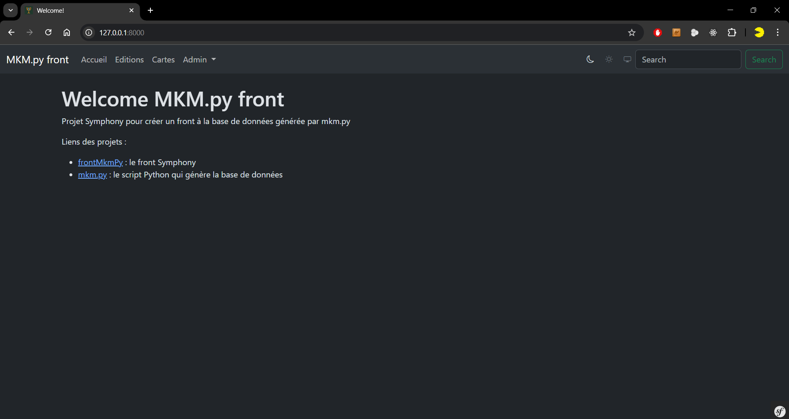
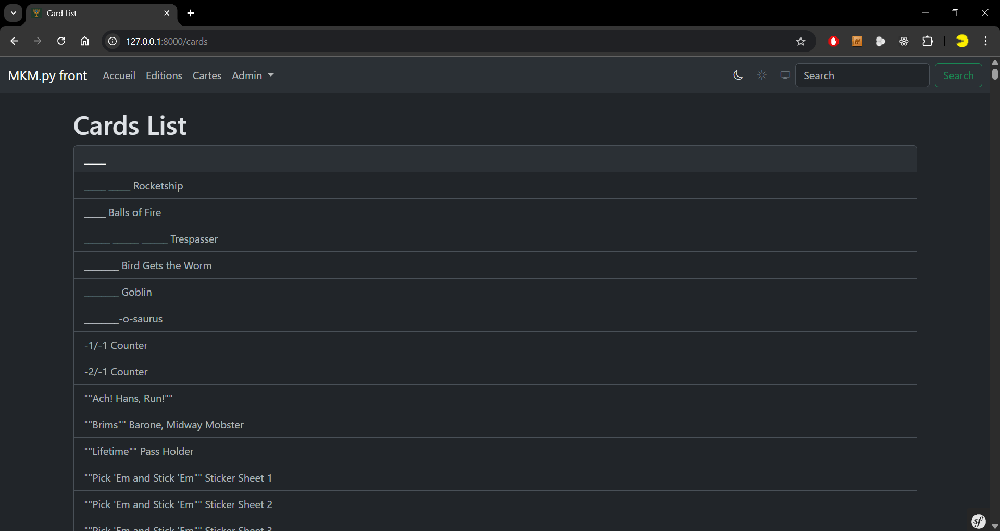
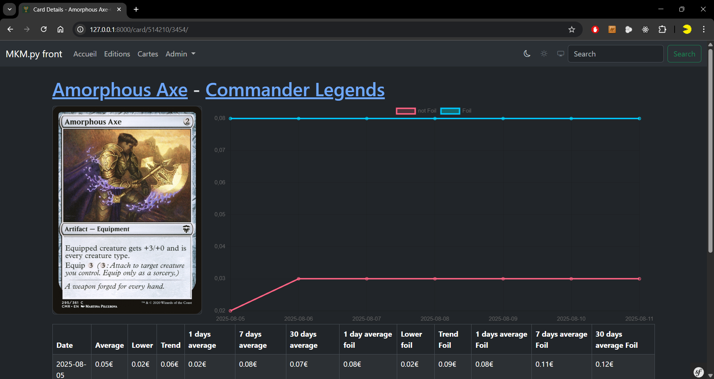
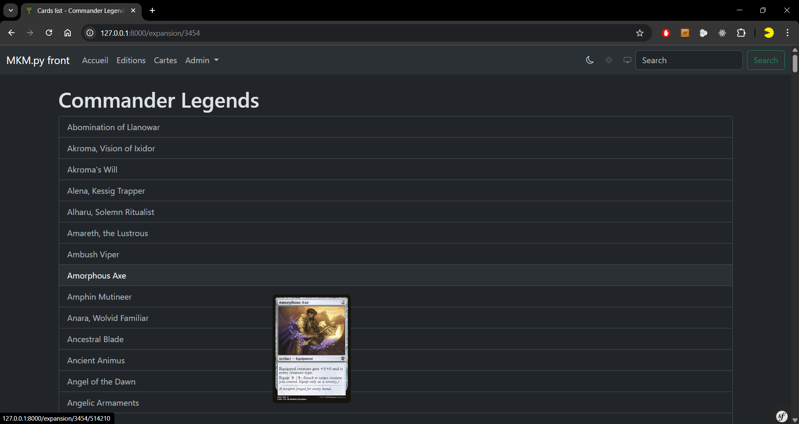
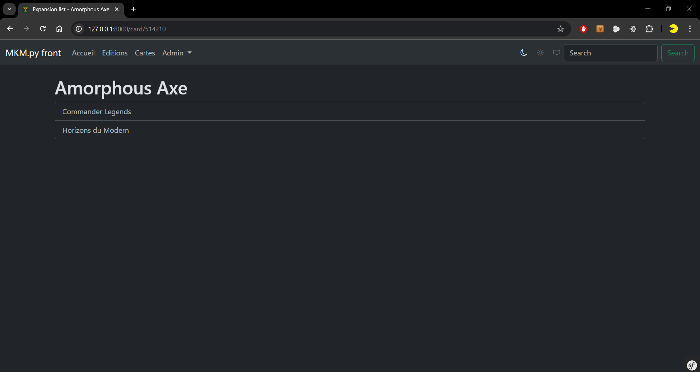
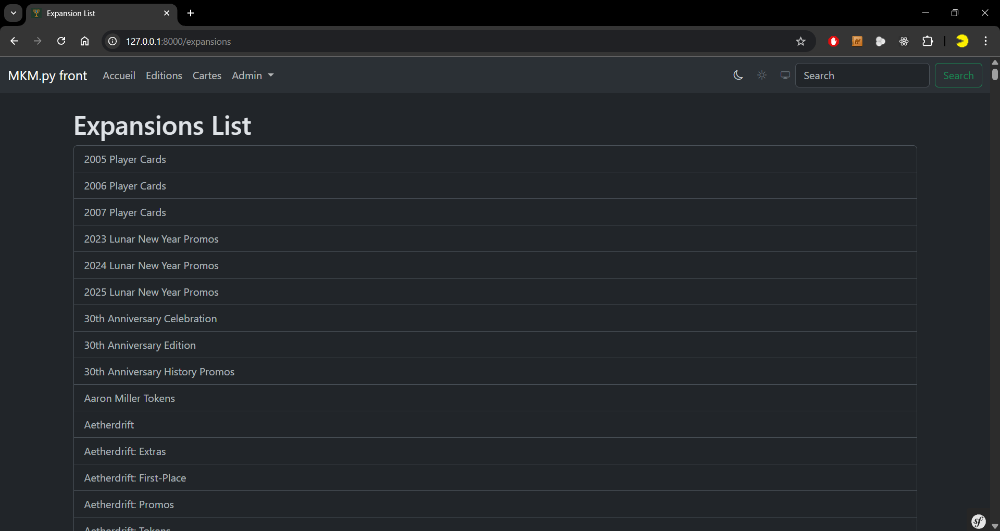
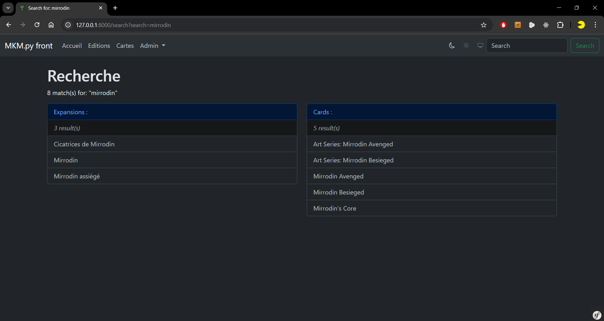
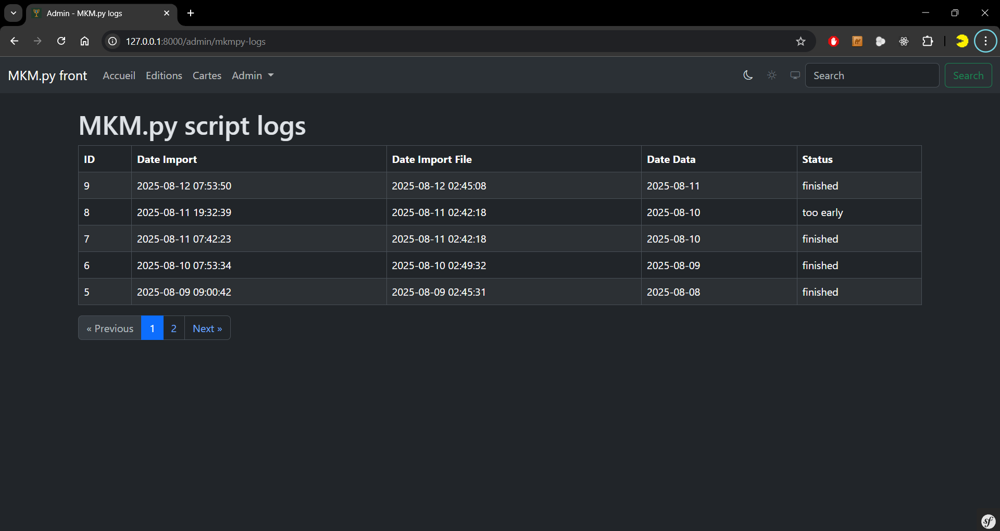
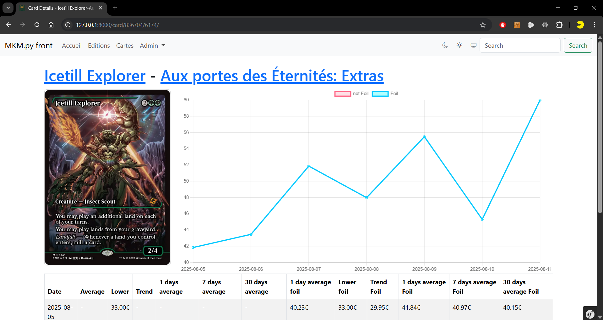

# frontMkmPy


frontMkmPy est une application web Symfony dédiée au suivi de l'évolution des prix des cartes à collectionner.
Elle sert d'interface front-end pour la base de données du projet [mkmpy](https://github.com/gschmirgal/mkmpy) : elle permet de visualiser, rechercher et analyser l'évolution des prix, extensions et informations associées, avec une interface moderne et responsive.

## Fonctionnalités principales

- **Suivi graphique** de l'évolution des prix des cartes (historique, comparaisons)
- **Interface moderne** avec thème clair/sombre automatique
- **Affichage des listes** de cartes, extensions, prix avec pagination
- **Recherche avancée** multi-critères et navigation rapide
- **Images hover** et prévisualisation des cartes
- **Design responsive** Bootstrap 5
- **Composants Twig** réutilisables (tables, listes de cartes)
- **Intégration Scryfall** pour les images et métadonnées

frontMkmPy est une application web Symfony dédiée au suivi de l’évolution des prix des cartes à collectionner.
Elle sert d’interface front-end pour la base de données du projet [mkmpy](https://github.com/gschmirgal/mkmpy) : elle permet de visualiser, rechercher et analyser l’évolution des prix, extensions et informations associées, avec une interface moderne et responsive.

## Fonctionnalités principales

- Suivi graphique de l’évolution des prix des cartes (historique, comparaisons)
- Affichage des listes de cartes, extensions, prix
- Recherche multi-critères et navigation rapide
- Thème clair/sombre, hover image, responsive Bootstrap
- Pagination (KnpPaginator)

## Stack technique

- **Symfony 7.3** 
- **Doctrine ORM 3.5+**
- **Twig**
- **Bootstrap 5** (avec thème sombre/clair)
- **Chart.js (Symfony UX)**
- **AssetMapper** (importmap, sans Webpack)
- **KnpPaginatorBundle** (pagination)
- **Symfony UX Components** (TwigComponent, Turbo, ChartJS)

## Prérequis

- **PHP >= 8.2**
- **Composer**
- **MySQL ou MariaDB**
- **Symfony CLI** (recommandé)
- Node.js (optionnel, pour certains assets)

## Installation

1. **Cloner le dépôt**
  ```bash
  git clone <url-du-repo>
  cd frontMkmPy
  ```
2. **Installer les dépendances PHP**
  ```bash
  composer install
  ```
3. **Configurer l’environnement**
  - Copier `.env` en `.env.local` et adapter `DATABASE_URL`.
4. **Créer la base et lancer les migrations**
  ```bash
  php bin/console doctrine:database:create
  php bin/console doctrine:migrations:migrate
  ```
5. **Compiler les assets**
  ```bash
  php bin/console asset-map:compile
  ```
6. **Lancer le serveur**
  ```bash
  symfony server:start
  # ou pour un accès réseau
  php -S 0.0.0.0:8000 -t public
  ```

## Mise à jour

Pour mettre à jour le projet vers les dernières versions :

```bash
# Mettre à jour les dépendances
composer update

# Appliquer les nouvelles migrations
php bin/console doctrine:migrations:migrate

# Recompiler les assets
php bin/console asset-map:compile

# Vider le cache
php bin/console cache:clear
```

## Structure du projet

- `src/Entity/` : Entités Doctrine (Products, Expansions, Prices, ScryfallProducts, ExpansionsMatching...)
- `src/Controller/` : Contrôleurs Symfony (Card, Expansion, Home...)
- `src/Repository/` : Repositories Doctrine avec requêtes optimisées
- `src/Twig/Components/` : Composants Twig réutilisables (TableComponent...)
- `templates/` : Templates Twig (pages, composants)
- `templates/components/` : Composants UI réutilisables
- `assets/` : Styles CSS et assets (AssetMapper)
- `migrations/` : Migrations Doctrine
- `public/` : Fichiers publics (images, assets compilés)

## Exemples d’utilisation

- Liste des extensions : `/expansions`
- Détail d’une carte : `/card/{cardid}/{expansionid}`
- Recherche : `/search?search=motclef`

## Contribution

1. Forkez le projet
2. Créez une branche (`git checkout -b feature/ma-feature`)
3. Commitez vos modifications
4. Poussez la branche (`git push origin feature/ma-feature`)
5. Ouvrez une Pull Request

## Liens utiles

- [Symfony](https://symfony.com/doc/current/index.html)
- [Doctrine](https://www.doctrine-project.org/projects/doctrine-orm/en/current/index.html)
- [Twig](https://twig.symfony.com/doc/3.x/)
- [KnpPaginatorBundle](https://github.com/KnpLabs/KnpPaginatorBundle)
- [Chart.js](https://www.chartjs.org/)

## Captures d'écran

Quelques aperçus de l'application :











## Licence

MIT